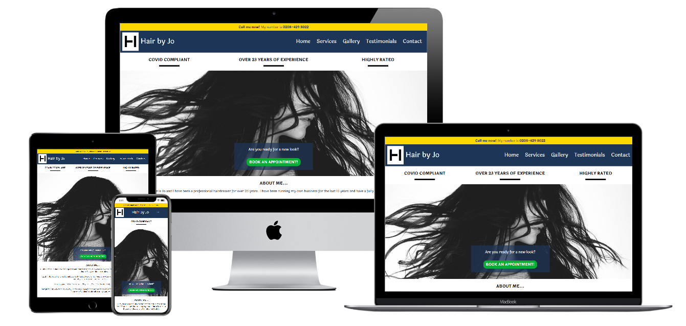

# [Hair by Jo](https://scottsimpson91.github.io/CI-MS1-Hair-by-Jo/)

[View the live project here](https://scottsimpson91.github.io/CI-MS1-Hair-by-Jo/)

The aim of my first project for the Code Institute was to create a platform for my sister's hairdressing business which was designed to increase the number of enquiries made.

### <u>Contents:</u>

* Description
* User Stories
* Market Research
* UX / Features
* Future Improvements
* Changes
* Technologies Used
* Testing
* Deployment
* Credits
* Acknowledgements
* Support

### <u>Description</u>

The Hair by Jo project was designed to provide my sister with a website where she is able to demonstrate her work and increase the number of enquiries made. By creating a website with a method of easily contacting her, this will hopefully make the process of getting an appointment a lot easier, which will ultimately increase business.

### <u>User Stories</u>

* "I want to easily understand the main purposes of the site and learn more about the business"
* "I want to be able to navigate throughout the site easily and find services and prices on offer"
* "I want to be able to access the website using my mobile device as this is what I would frequently use to access this type of service"
* "I want to be able to see testimonials to see what her customers think of Jo and see that she is trusted"
* "I want to locate social media links to see visual representations of her work"
* "I want to easily be able to contact Jo and find out availability for an appointment"
* "I want to know that the business is working inline with current government guidelines surrounding COVID"

### <u>Market Research</u>

I decided to carry out B2C interviews with customers to find out what makes a good UX and what information and features they would like to see on the website.

All of this information was used when designing the layout, colour scheme, typography, imagery and features that were deployed on the final website.

### <u>UX</u>

The website was designed mainly for a female demographic of all ages, however with the male customer also in mind. It was designed to be a simple, yet effective website which clearly demonstrated examples of Jo's work and ways to contact her.

##### <u>1. Strategy</u>

The aim of the project was to increase the number of enquiries made with the business by providing a simple and clean UX which was user-friendly. An increased number of enquiries will hopefully lead to more appointments.

###### Business Goals

* Increase the number of enquiries made
* Increase the number of followers on social media accounts
* Provide up-to-date information about the services and prices of the business
* Provide evidence that the business is operating safely throughout the COVID crisis
* Demonstrate examples of work to show customers what the finished product looks like
* Create an overall positive UX for customers by providing a simple, yet effective website

###### Customer Goals

* Easy to find contact information to make enquiries

* Easy to find links to social media accounts to follow and also see examples of work

* Easy to access information about services and prices on offer

* Evidence that the business is operating in-line with COVID guidelines

* Easy to find gallery to highlight examples of work carried out

* Mobile-first design as this is likely the most frequent way of finding and researching the business

  

##### <u>2. Scope</u>

The scope of the project and features to include were influenced by the market research carried out with customers. It should be a mobile-first website that is responsive on all devices.

###### Current Features

* Navigation Bar
  * Large font used to make finding and distinguishing different pages easy
  * Responsive navigation bar that condenses down to an icon on smaller devices
  * Contact form modal which is linked to all pages and useable on all devices to increase enquiries

* Home Page
  * Book an appointment button to act as a clear and immediate call to action to increase enquiries
  * Basic animated hero image to enhance overall UX
  * Small about me section to quickly express Jo's experience and a brief overview of services offered
  * Link to services and prices page so customer are easily able to find what information they need
* Services Page
  * Easy to read list of all services and prices on offer
  * Picture of the salon so customers are able to see the environment they would be potentially visiting
  * Clear explanation and assurance that the business is working through within government COVID guidelines

* Gallery Page
  * Simple and responsive layout that clearly shows some work that Jo has carried out
  * A number of pictures included clearly demonstrate protective gowns and facemasks being worn due to COVID
  * Mixture of pictures used that highlight different hair styles on offer
* Testimonials Page
  * Clear examples of recent testimonials from customers and where they are found
* Footer
  * Clear indication of where the business is located and ways to contact
  * Links to social media accounts to demonstrate work and increase following

##### <u>3. Structure</u>

The site was designed to have essential pages which are Home, Services, Gallery, Testimonials and a Contact modal which was gathered using B2C research. The same navigation bar and footer will be used across all pages for consistency and better IXD.

Short and easy to read paragraphs were used to easily get essential information across to customers. A call to action was included on the home page to make it easy to contact the business as the ultimate goal was to increase the number of enquiries.

A selection of quality images were used to be engaging and provide clear examples of work and the salon where the business is.

A footer with clear ways of contacting the business and links to the social media was used to again ultimately increase the number of enquiries and following on social media.

##### <u>4. Skeleton</u>

* [Wireframe](assets/docs/hair-by-jo-wireframe.pdf) was created using [Balsamiq](https://balsamiq.com/)

##### <u>5. Surface</u>

###### Design

* Colour Scheme
  * The main colour used throughout the website is a dark blue (#1D3557) which provide a slick and professional look
  * This was combined with white (#fff), black (#000) and yellow (#ffd700) to make all text stand out
* Typography
  * Laila was used as the main font throughout the website as it is rounded and easy to read across all devices. Serif was used as a backup font should the primary one not load
* Imagery
  * The home page used a black and white image which was animated to provide and engage users
  * An image of the salon was used on the services pages to show customers the environment in which they may be visiting
  * A collection of different images were used on the gallery page to demonstrate some of the work that was recently carried out and also demonstrate that safety measures in place due to COVID
* Icons
  * Icons across the website were sourced from [Font Awesome](https://fontawesome.com/), which provided visual indications of what the section was about

### <u>Future Improvements</u>

* Form submission and book appointment button to be functional
* Implement a booking system, whereby a customer is able to directly book in and see the diary rather than having to make an enquiry first
* Improve the level of detail in terms of the types of products used
* Create additional pages that highlight different aspects of work specifically (Hair extensions/Bridal) and other products that are able to be sold to customers
* Create a live feed for Instagram and Facebook that automatically update photos that are on display on the website
* Create a mailing list for customers that can include offers and discounts on treatments, but also provide an easy way of communicating with all customers. With the continuous changes surrounding COVID, an easy way of communicating changes to customers would be useful.

### <u>Changes</u>

A number of changes were made after the initial wireframe was created, these include:

* Animated hero image was include with some overlay text rather than three static circular images. This was changed as it felt more engaging and would lead to an increased number of enquiries
* Carousel was meant to be included on the Gallery page, but there was some difficulty with the actual coding of it and I experienced a number of issues around this, so I decided to change to a simple thumbnail gallery format which clearly demonstrates a number of different types of styles and safety guidelines
* Colour scheme was changed to a navy blue as this felt more slick and professional
* Added additional images to home page to make it more appealing and show off some additional competition work that Jo carried out

### <u>Technologies Used</u>

###### Languages Used

* [HTML5](https://en.wikipedia.org/wiki/HTML5)
* [CSS3](https://en.wikipedia.org/wiki/CSS)

###### Frameworks, Libraries & Programs Used

* [Bootstrap 4.5.3](https://getbootstrap.com/)
* [Hover.css](https://ianlunn.github.io/Hover/)
* [Google Fonts](https://fonts.google.com/)
* [Font Awesome](https://fontawesome.com/)
* [jQuery](https://jquery.com/)
* [Git](https://git-scm.com/)
* [GitHub](https://github.com/)
* [Balsamiq](https://balsamiq.com/)
* [Tailor Brands](https://www.tailorbrands.com/)
* [Microsoft Paint](https://en.wikipedia.org/wiki/Microsoft_Paint)
* [Coolors](https://coolors.co/ebf5df-bad4aa-d4d4aa-edb458-e8871e)
* [Typora](https://typora.io/)
* [Techsini](http://techsini.com/multi-mockup/index.php)
* [Chrome DevTools](https://developers.google.com/web/tools/chrome-devtools)

### <u>Testing</u>

###### Validation

The W3C Markup Validator and W3C CSS Validator Services were used to validate every page of the project to ensure there were no syntax errors in the project.

[W3C Markup Validator](https://validator.w3.org/) - [Results]()

[W3C CSS Validator](https://jigsaw.w3.org/css-validator/) - [Results]()

###### Devices

The website was initially tested on different types of devices using Chrome DevTools to see if there were any immediate issues. The website was then sent via email to a number of family and friends of all ages to test on different devices to see how responsive it was.

The following devices were used:

* iPhone X
* iPad Air
* iPad Mini
* Samsung Galaxy S9
* iMac - OS X Yosemite
* iPhone 7
* iPhone 11 Pro Max
* Sony Vaio Laptop - Windows 8

###### Errors During Device Testing

* iPad Mini / iPad Air
  * Menu icon not aligned to right, but moves to the right when clicked
  * Some footer text overlapped
  * Modal button possibly needed enlarging
* iPhone 7
  * Vertical scrolling appeared within footer, gallery and testimonials
* iPhone X
  * Modal button possibly needed enlarging
  * Vertical scrolling appeared on testimonials page
* iPhone 11 Pro Max
  * Vertical scrolling appeared in the home page paragraph text, testimonials and footer
* Samsung Galaxy S9
  * No immediate issues
* iMac - OS X Yosemite
  * No immediate issues
* Sony Vaio Laptop - Windows 8
  * No immediate issues

###### Errors During Testing

* [W3C Markup Validator](https://validator.w3.org/)
  * "The document is not mappable to XML 1.0 due to two consecutive hyphens in a comment" - Solution found [here](https://www.experts-exchange.com/questions/28661509/The-document-is-not-mappable-to-XML-1-0-due-to-two-consecutive-hyphens-in-a-comment.html)
  * "Attribute *type* not allowed on element *textarea* at this point" - Solution found [here](https://stackoverflow.com/questions/11491639/w3c-markup-validation-html5-textarea)
  * "Bad value for attribute *href* on element *a*: Illegal character in query: space is not allowed" - Solution found [here](https://stackoverflow.com/questions/28535529/w3c-error-validating-bad-value-for-attribute-href-on-element-a-illegal-charac)
  * "The *aria-labelledby* attribute must point to an element in the same document" - Solution found [here](https://stackoverflow.com/questions/39831658/how-to-fix-the-aria-labelledby-attribute-must-point-to-an-element-in-the-same-d)
  * "Start tag *h5* seen in table" - Solution found [here](https://stackoverflow.com/questions/29267642/validation-notice-start-tag-div-seen-in-table)
  * "Section lacks heading. Consider using *h2-h6* elements to add identifying headings to all sections." - Solution found [here](https://stackoverflow.com/questions/24155024/w3c-html-validation-error-section-lacks-heading-consider-using-h2-h6-elements)

* [W3C CSS Validator](https://jigsaw.w3.org/css-validator/) 
  * No errors found

###### Known Bugs

* Menu icon appearing in the middle of the navbar when viewed on an iPad, but then moves to the right when clicked

### <u>Deployment</u>

### <u>Credits</u>

###### Media

* Hero image sourced from [Unsplash](https://unsplash.com/photos/z0FhTWzKtxY)
* Other images sourced from Jo with permission who owns the photos and are published on her [Facebook](https://www.facebook.com/Hair-By-Jo-241825395880141) and [Instagram](https://www.instagram.com/hairbyjo_jo.x/)
* 404 page image was created by Gan Khoon Lay from the [Noun Project](Bad Haircut by Gan Khoon Lay from the Noun Project)

###### Code Snippets

* [Code Institute](https://codeinstitute.net/) 
  * Code for hero image and animation from the "Love Running" lessons and adapted to own project
  * Code for site wide alert and main button from "Whiskey Drop" lessons and adapted to own project
  * Influence from "CV Resume" lessons and adapted to own project
* [Codeply](https://www.codeply.com/)
  * Code for Navbar used and adapted to own project - [Here](https://www.codeply.com/go/qhaBrcWp3v)
  * Guidance on vertical centering images - [Here](https://www.codeply.com/go/WG15ZWC4lf)
* [MdBoostrap](https://mdbootstrap.com/docs/jquery/modals/forms/)
  * Code for modal form used and adapted to own project - [Here](https://mdbootstrap.com/docs/jquery/modals/forms/)
* [Bootstrap](https://getbootstrap.com/)
  * Code for table used and adapted to own project - [Here](https://getbootstrap.com/docs/4.0/content/tables/)
  * Guidance on text alignment code - [Here](https://getbootstrap.com/docs/4.0/utilities/text/)
* [Stack Overflow](https://stackoverflow.com/)
  * Guidance on horizontally centering button - [Here](https://stackoverflow.com/questions/15300234/how-can-i-horizontally-center-a-button-element-in-a-div-element)
* [Start Bootstrap](https://startbootstrap.com/)
  * Code for gallery used and adapted to own project - [Here](https://startbootstrap.com/snippets/thumbnail-gallery/)
* [CSS-Tricks](https://css-tricks.com/)
  * Guidance on fixing overflow issues - [Here](https://css-tricks.com/findingfixing-unintended-body-overflow/)
* [Slack](https://slack.com/intl/en-gb/)
  * Guidance on creating a custom 404 error page from Karina Finegan and Anthony O'Brien - [Here](https://code-institute-room.slack.com/archives/C7J2ZAVHB/p1598280091096500)

###### Content

All text content was written by the developer

### <u>Acknowledgements</u>

I would like to thank the following:

* My mentor, **Spencer Barriball**, for his guidance, wisdom and encouragement throughout the project
* **CI Staff** and **Slack Community** for their assistance with minor coding issues
* **Jim Morel**, for hosting calls with students about the MS1 project and for discussing my initial wireframe with me

### <u>Support</u>

For any issues or information, please email me on scottsimpson7@googlemail.com

Thanks for taking the time to view my README. I hope you enjoyed your visit to my page.

